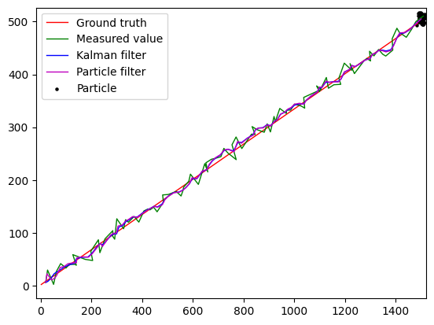
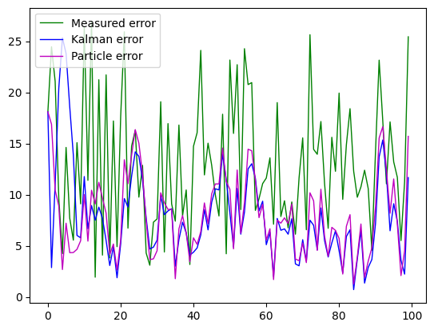
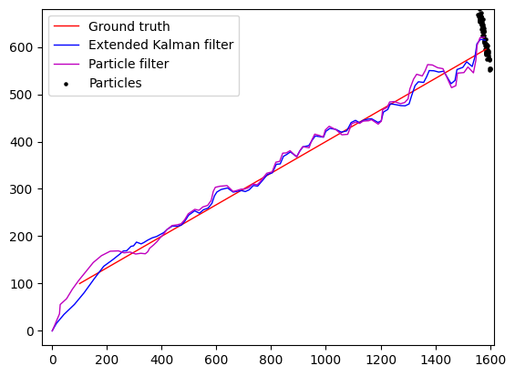
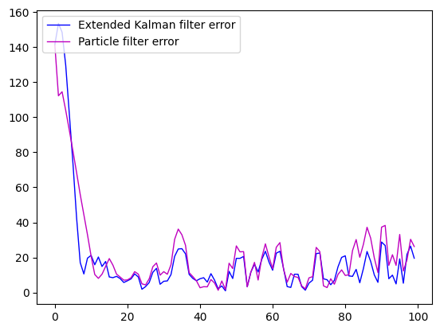

[](https://github.com/lh9171338/Outline) Localization
=================================================================================================================================================

# Introduction

This is a repository for localization based on Kalman filter, extended Kalman filter, and particle filter.

# Requirement

```shell
pip install -r ./requirements.txt
```

# Simple Usage

Build a Kalman filter with a python class and run it.

```python
import numpy as np
from filter import KalmanFilter

# Model parameter
dimx = 4
dimz = 2
F = np.array([[1, 0, 1, 0], [0, 1, 0, 1], [0, 0, 1, 0], [0, 0, 0, 1]], dtype=np.float32)
G = np.zeros((4, 1), dtype=np.float32)
H = np.array([[1, 0, 0, 0], [0, 1, 0, 0]], dtype=np.float32)
Q = 1 * np.array([[1, 0, 1, 0], [0, 1, 0, 1], [0, 0, 1, 0], [0, 0, 0, 1]], dtype=np.float32)
R = 100 * np.eye(dimz, dtype=np.float32)

# Build Kalman filter
kalmanFilter = KalmanFilter(sys=[F, G, H], Q=Q, R=R)

# Run Kalman filter
x0 = np.array([zs[0, 0], zs[0, 1], 0, 0], dtype=np.float32)
P0 = np.eye(dimx, dtype=np.float32)
kalmanFilter.init(x0=x0, P0=P0)

xs1 = np.zeros_like(xs)
xs1[0] = x0[:2]
for i in range(1, N):
    x, _ = kalmanFilter.update(z=zs[i])
    xs1[i] = x[:2]
```

Build a particle filter with a python class and run it.

```python
import numpy as np
from filter import ParticleFilter

# Build Particle filter
numParticles = 1000
P0 = 100 * np.eye(dimx, dtype=np.float32)
f = lambda x: np.matmul(F, x)
g = lambda x: np.matmul(G, x)
h = lambda x: np.matmul(H, x)
particleFilter = ParticleFilter(sys=[f, g, h], Q=Q, R=R)

# Run Particle filter
particles = particleFilter.init(x0=x0, P0=P0, numParticles=numParticles)
xs2 = np.zeros_like(xs)

particlesList = np.zeros((N, numParticles, 2), dtype=np.float32)
xs2[0] = x0[:2]
particlesList[0] = particles[:, :2]
for i in range(1, N):
    x, particles = particleFilter.update(z=zs[i])
    xs2[i] = x[:2]
    particlesList[i] = particles[:, :2]
```

Build an extended Kalman filter with a python class and run it.

```python
import sympy
import numpy as np
from filter import ExtendedKalmanFilter

# Model parameter
dimx = 4
dimz = 3
F = np.array([[1, 0, 1, 0], [0, 1, 0, 1], [0, 0, 1, 0], [0, 0, 0, 1]], dtype=np.float32)
G = np.zeros((dimx, 1), dtype=np.float32)
Q = 1 * np.array([[1, 0, 1, 0], [0, 1, 0, 1], [0, 0, 1, 0], [0, 0, 0, 1]], dtype=np.float32)
R = 100 * np.eye(dimz, dtype=np.float32)

# Build Kalman filter
s1 = np.array([0, 0], dtype=np.float32)
s2 = np.array([200, 0], dtype=np.float32)
s3 = np.array([0, 200], dtype=np.float32)
symx = np.asarray(list(sympy.symbols('x1 x2 x3 x4')))
symu = np.array([sympy.symbols('u')])
symf = np.matmul(F, symx)
symg = np.matmul(G, symu)
symh1 = sympy.sqrt((symx[0] - s1[0]) ** 2 + (symx[1] - s1[1]) ** 2)
symh2 = sympy.sqrt((symx[0] - s2[0]) ** 2 + (symx[1] - s2[1]) ** 2)
symh3 = sympy.sqrt((symx[0] - s3[0]) ** 2 + (symx[1] - s3[1]) ** 2)
symh = np.array([symh1, symh2, symh3])
extendedKalmanFilter = ExtendedKalmanFilter(sys=[symx, symu, symf, symg, symh], Q=Q, R=R)

# Run Kalman filter
x0 = np.zeros(dimx, dtype=np.float32)
P0 = np.eye(dimx, dtype=np.float32)
extendedKalmanFilter.init(x0=x0, P0=P0)
xs1 = np.zeros_like(xs)
xs1[0] = x0[:2]
for i in range(1, N):
    x, _ = extendedKalmanFilter.update(z=zs[i])
    xs1[i] = x[:2]
```

# Demo

```shell
# Linear case
python kalmanfilter_demo.py

# Noninear case
python extendedkalmanfilter_demo.py
```

# Result

<p align="center">
    
    
    Linear case: value (left) and error (right)
    <br>
    
    
    Noninear case: value (left) and error (right)
</p>
